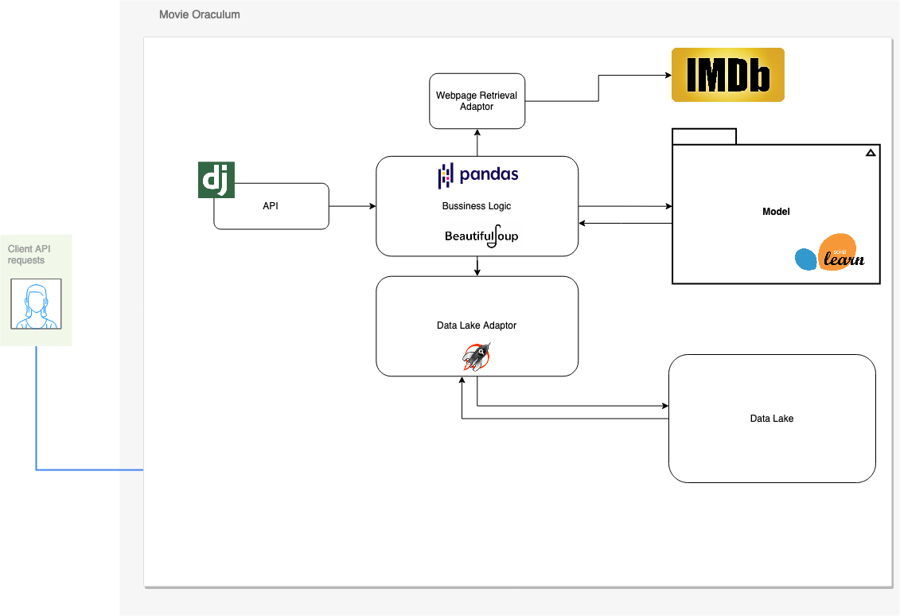

# movie-oraculum
Django web-app with a recommendation system about films, using the [movielens](https://movielens.org/) dataset. It also provides a sentiment analysis functionality used to analyze movie-reviews.

## Architecture

## Run it
Make sure to have installed the libraries from `requirements.txt`

Also have Python >= 3.10 installed. (Python version used: 3.10.4)

Make sure to have the following files in the project root:
- `model.joblib`
- `recomendation_matrix.npy`
- `indices.joblib`
- `imdb_ids.npy`

To run it, just execute `python manage.py runserver`